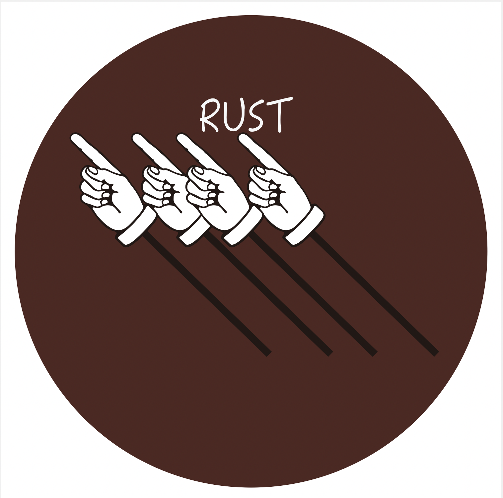
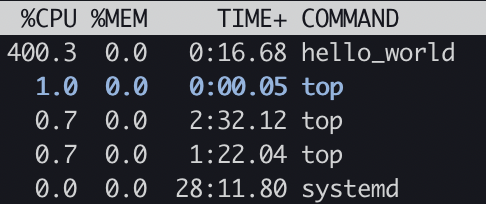
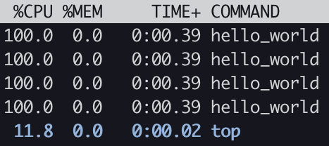
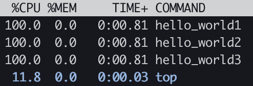
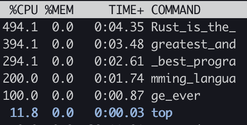
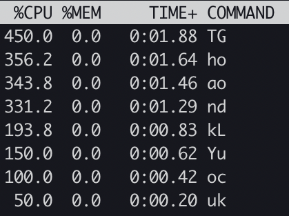
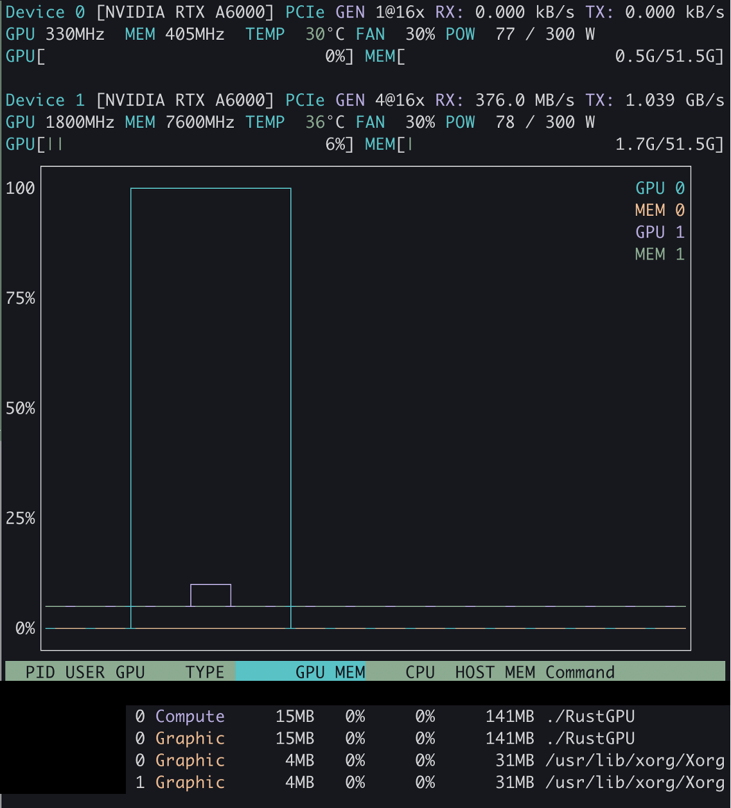

  
  <h2 align="center"> kanban; 看板</h2>
  
A joke tool that displays your message on "top(1)/nvtop/nvitop" using parallel process

  
  
  
  
  

# kanban

- [kanban](#kanban)
  - [Install](#install)
    - [Dependencies](#dependencies)
  - [Install OpenMPI version](#install-openmpi-version)
    - [Dependencies](#dependencies-1)
  - [Gallery](#gallery)
  - [Quick start \& Examples](#quick-start--examples)
    - [Single mode](#single-mode)
    - [Multiple mode](#multiple-mode)
    - [Multiple2 mode](#multiple2-mode)
    - [Long mode](#long-mode)
    - [Vertical mode](#vertical-mode)
    - [Wave mode](#wave-mode)
    - [Gpu mode](#gpu-mode)
    - [RawSingle mode](#rawsingle-mode)
    - [RawGpu mode](#rawgpu-mode)

## Install
~~~shell
cargo install --git https://github.com/th2ch-g/kanban.git kanban --locked
~~~

### Dependencies
- [Rust](https://www.rust-lang.org/tools/install)
    - kanban requires Rust environment

## Install OpenMPI version
~~~shell
cargo install --git https://github.com/th2ch-g/kanban.git kanban-mpi --locked
~~~

### Dependencies
- openmpi(4.0.3)
- intel-mpi(19.0)

## Gallery
<a href=#single>
    </img>
</a>

<a href=#multiple>
    </img>
</a>

<a href=#multiple2>
    </img>
</a>

<a href=#long>
    </img>
</a>

<a href=#vertical>
    </img>
</a>

<a href=#gpu>
    </img>
</a>

## Quick start & Examples

### Single mode
~~~shell
kanban single -m hello_world -@ 4 -t 20 & top
~~~

### Multiple mode
~~~shell
kanban multiple -m hello_world -@ 4 -t 20 & top
~~~

### Multiple2 mode
~~~shell
kanban multiple2 -m "hello_world1" "hello_world2" "hello_world3" -t 20 & top
~~~

### Long mode
~~~shell
kanban long -m Rust_is_the_greatest_and_best_programming_language_ever -t 20 & top
~~~

### Vertical mode
~~~shell
kanban vertical -m "ThankYou" "GoodLuck" -t 20 & top
~~~

### Wave mode
~~~shell
kanban wave -m 123456789 -@ 4 & top
~~~

### Gpu mode
- [nvtop](https://github.com/Syllo/nvtop)
- [nvitop](https://github.com/XuehaiPan/nvitop)
- tested on NVIDIA RTX A6000, M1MacOS.
~~~shell
# nvidia-smi
kanban gpu -m "RustGPU" & nvidia-smi
# nvtop
kanban gpu -m "RustGPU" & nvtop
# nvitop
kanban gpu -m "RustGPU" & nvitop
~~~

### RawSingle mode
- Run immediately without compiling or copying and without changing the command name.
- CPU is used
~~~shell
kanban raw-single -m "aaa" -t 20 & top
~~~

### RawGpu mode
- Run immediately without compiling or copying and without changing the command name.
- GPU is used by wgpu
~~~shell
kanban raw-gpu -m "aaa" -t 20 & nvtop
~~~

